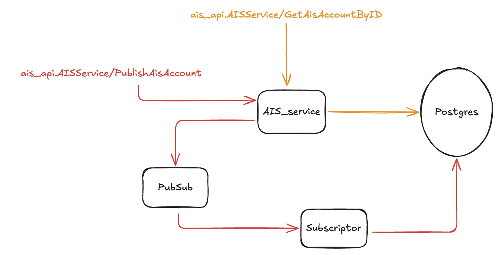

## API
- ais_api.AISService/GetAisAccountByID: Get account's infomation by ID
- ais_api.AISService/PublishAisAccount: Publish account to PubSub

## Architecture


### 1. Clone the Repository

First, clone the GoLoad repository to your local machine:
```
git clone git@github.com:khanh-dao-kd/AIS.git
cd AIS
```
### 2. Docker Setup
Run the application using Docker Compose. This will start the necessary services like Postgres, Emulator:
```
cd deployments
```
```
docker-compose up
```
### 3. Run the application
run service:
```
go run cmd/main.go
```